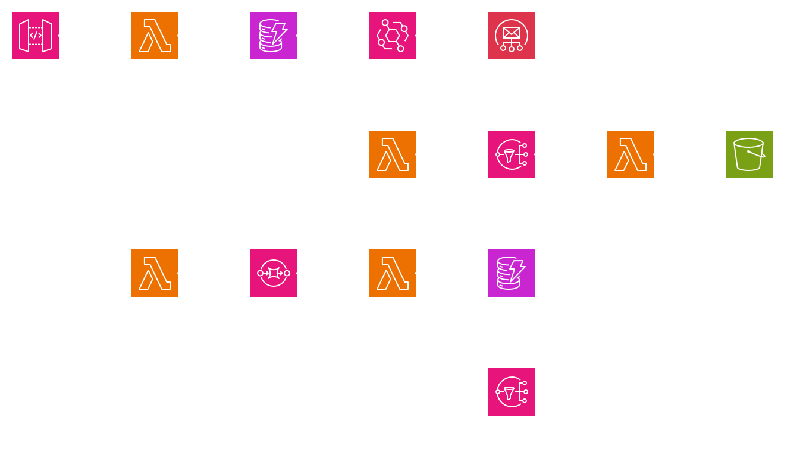

# Arch gen

A cli tool to generate AWS architecture diagrams from yml files.

I made this at a hackathon so it's clearly missing some features:
- Cycles. The connections can only go one way
- Arrows. There are no arrows on the drawn lines
- Efficient placement of the nodes on the grid

## Usage

### Running the tool

```sh
./arch-gen
```

There are different flags that can be passed to the tool

- `-i` the name of the input file. Defaults to `arch-gen.yml`
- `-o` the name of the output file. Defaults to `arch-gen.png`
- `-height` the height in pixels of the png image in the output. Defaults to `1024`.
- `-width` the width in pixels of the png image in the output. Defaults to `1024`.

Can be used like so:

```sh
./arch-gen -i input-file.yml -o output-image.png --width 500 --height 250
```

### Yaml syntax

There are four valid yaml keys

- type: the type of the resource. These must match the name of the files in `images/`.
- title: the title of the resource
- children: any children the resource may have. The children will be connected to the current resource.
- scale: This will scale the line between the current resource and its parent

## Example

```yaml
type: Amazon-API-Gateway
title: v1/api/resource
children:
  - type: AWS-Lambda
    title: api handler
    children:
      - type: Amazon-DynamoDB
        title: Resource
        children:
          - type: Amazon-EventBridge
            title: Updates EventBridge Pipe
            children:
              - type: Amazon-Simple-Email-Service
                title: Update Emailer
          - type: AWS-Lambda
            title: Delete stream
            children:
              - type: Amazon-Simple-Notification-Service
                title: Delete Topic
                children:
                  - type: AWS-Lambda
                    title: Deleter
                    children:
                      - type: Amazon-Simple-Storage-Service
                        title: Resource storage

  - type: AWS-Lambda
    title: Metrics Lambda
    scale: 2.0 # This will double the vertical distance between this resource and the parent
    children:
      - type: Amazon-Simple-Queue-Service
        title: Metrics
        children:
          - type: AWS-Lambda
            title: Metrics service
            children:
              - type: Amazon-DynamoDB
                title: Metrics table
              - type: Amazon-Simple-Notification-Service
                title: Metrics Topic
```

This will result in the following image being generated:


## Credits

Icons are sourced from https://aws.amazon.com/architecture/icons/ and are fully owned by [Amazon Web Services. Inc.](https://aws.amazon.com/). Terms of use at https://aws.amazon.com/architecture/icons/.
